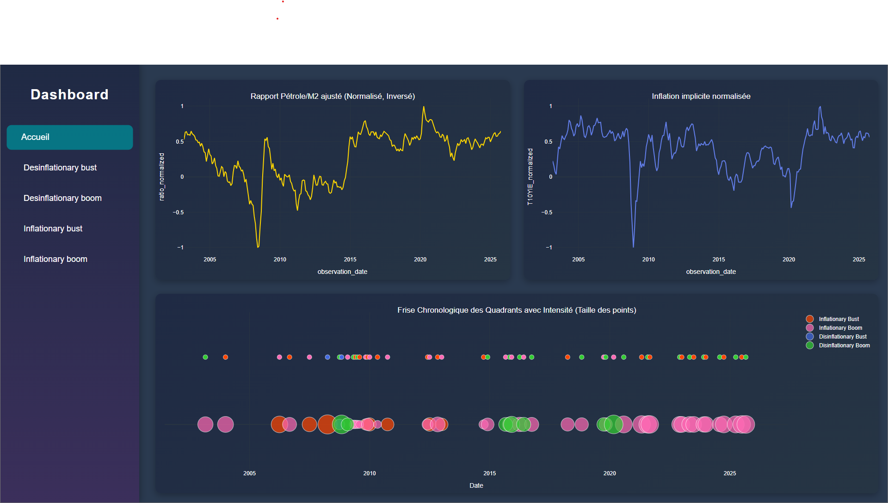

# Dashboard

## Aperçu

Ce dépôt contient une application web de dashboard financier, accessible en ligne à l'adresse [https://finance.518.fr/](https://finance.518.fr/). Développée principalement en Python, elle propose des visualisations interactives et des analyses de tendances d'investissement, inspirées de cadres économiques et financiers reconnus.

Le concept central repose sur une approche d'investissement par quadrants, favorisant la diversification pour faire face aux différents scénarios économiques (prospérité, inflation, récession, déflation).


Le graphique le plus intéressant de la page 1 utilise des **boules** colorées pour représenter les tendances principales et secondaires :

- **Boule Rose** : Or (point de schelling)
- **Boule Verte** : ETF Chine + Énergie (toutes les grandes crises commencent par une hausse du prix de l'énergie)
- **Boule Rouge** : Yen et Renminbi (monnaies avec un indice Big Mac sous évalué)
- **Boule Bleue** : Obligations Brésil / Islande (quadrant à la plus faible espérence de rendement)



La boule située en haut indique une tendance faible, tandis que celle en bas représente une tendance forte. La taille des boules reflète l’intensité de chaque tendance. Une boule marque le début d’une tendance, et l’apparition d’une nouvelle boule signale la fin de la précédente.
Grâce à la méthode de calcul utilisée, les boules permettent d’anticiper les performances à venir.

## Technologies utilisées

- **Langage** : Python (97,3 % du code)
- **Conteneurisation** : Docker (`Dockerfile` et `docker-compose.yml`)
- **Dépendances** : Liste dans `requirements.txt` (visualisation de données, framework web, etc.)
- **Structure** : `app.py` (point d'entrée), pages modulaires (`page1.py` à `page6.py`), assets et données statiques.

## Installation et lancement

1. Cloner le dépôt :
   ```
   git clone https://github.com/Skyedge1903/Dashboard.git
   cd Dashboard
   ```

2. Installer les dépendances :
   ```
   pip install -r requirements.txt
   ```

3. Lancer l'application :
   - Localement : `python app.py` (ou selon le framework utilisé, souvent Streamlit)
   - Avec Docker : `docker-compose up`

Accédez au dashboard via votre navigateur (généralement http://localhost:8501).

## Inspirations et crédits

Ce projet s'inspire fortement du **Portefeuille Permanent** développé par **Harry Browne** dans les années 1980 : une allocation équilibrée (25 % chacun) en actions, obligations longues, liquidités et or, pour performer dans tous les environnements économiques.


Il intègre également les analyses économiques de **Charles Gave**, économiste français libéral, fondateur de Gavekal Research et de l'**Institut des Libertés** (think tank promouvant les idées de liberté économique).

.

## Licence

Open-source (vérifier le fichier LICENSE dans le dépôt, généralement MIT).

Le présent code, le site web qui lui est associé, ainsi que toute infographie ou tout contenu visuel qui pourrait en être extrait, ne constituent en aucun cas un conseil en investissement, une recommandation d’achat ou de vente, ni une incitation à prendre des décisions financières.

Démo en ligne : [https://finance.518.fr/](https://finance.518.fr/)

## Pour apprendre à faire ce genre de dashboards

Formation complète sur la data science et data analyse [->](https://doc.518.fr/s/VvUJg-V1e)
[https://doc.518.fr/s/VvUJg-V1e](https://doc.518.fr/s/VvUJg-V1e)
